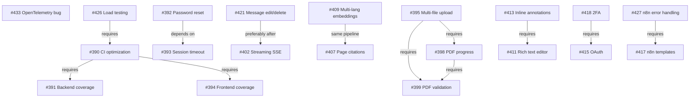

# Piano di Risoluzione Issue - MeepleAI Monorepo

## Metodologia di Parallelizzazione

Questo calendario è stato costruito analizzando 41 issue aperte e identificando opportunità di parallelizzazione basate su:

1. **Separazione delle Aree**: Issue che toccano aree diverse del codebase (backend/frontend/infra/docs) possono essere lavorate in parallelo
2. **Dipendenze**: Identificazione di blocchi e prerequisiti tra issue
3. **Skill Diversity**: Issue che richiedono competenze diverse (DevOps, Backend, Frontend, AI/ML) possono essere assegnate a team separati
4. **Complessità e Effort**: Bilanciamento del carico di lavoro tra sprint

### Priorità di Risoluzione

**Criteri applicati:**
- 🔴 **Critical/High Priority**: Bug critici, test coverage, problemi di sicurezza/stabilità
- 🟡 **Medium Priority**: Feature importanti, miglioramenti UX
- 🟢 **Low Priority**: Funzionalità nice-to-have, esperimenti

### Legenda Label

- **Effort**: S (Small, 1-2 giorni), M (Medium, 3-5 giorni), L (Large, 1-2 settimane), XL (Extra Large, 2-4 settimane)
- **Epic**: testing, auth, pdf, chat, rag, editor, admin, n8n, ops
- **Area**: backend, frontend, infra, docs

---

## Timeline - Grafico Gantt

```mermaid
gantt
    title Piano di Risoluzione Issue MeepleAI (12 Sprint × 2 Settimane)
    dateFormat YYYY-MM-DD

    section Sprint 1-2 (Fondamenta)
    #433 OpenTelemetry bug :crit, bug433, 2025-10-17, 2d
    #391 Backend coverage 90% :crit, test391, 2025-10-17, 18d
    #394 Frontend coverage 90% :crit, test394, 2025-10-19, 12d
    #390 CI optimization <10min :active, ops390, 2025-10-21, 5d
    #426 Load testing k6 :active, test426, 2025-10-26, 6d
    #393 Fix session timeout :auth393, 2025-10-17, 2d
    #392 Password reset flow :auth392, 2025-10-19, 5d

    section Sprint 3-4 (PDF Pipeline)
    #399 PDF pre-upload validation :pdf399, 2025-11-03, 4d
    #396 PDF error handling :pdf396, 2025-11-03, 4d
    #398 PDF progress tracking :pdf398, 2025-11-07, 4d
    #397 PDF preview component :pdf397, 2025-11-07, 8d
    #395 Multi-file PDF upload :pdf395, 2025-11-11, 8d

    section Sprint 5-6 (Chat UX)
    #402 Streaming SSE responses :crit, chat402, 2025-11-17, 9d
    #403 Multi-doc context switch :chat403, 2025-11-17, 5d
    #401 AI follow-up questions :chat401, 2025-11-22, 4d
    #400 Polish loading animations :chat400, 2025-11-22, 4d
    #421 Message edit/delete :chat421, 2025-11-26, 4d
    #404 Conversation export :chat404, 2025-11-26, 4d
    #423 Caching optimization :perf423, 2025-11-17, 6d

    section Sprint 7-8 (AI/RAG Enhancement)
    #407 Page number citations :rag407, 2025-12-01, 5d
    #408 Redis cache optimization :rag408, 2025-12-01, 5d
    #409 Multi-language embeddings :rag409, 2025-12-06, 9d
    #410 Response quality scoring :rag410, 2025-12-08, 5d
    #406 Personalized ranking :rag406, 2025-12-13, 8d
    #422 Hybrid vector+keyword search :rag422, 2025-12-15, 9d
    #424 Fine-tuning experiments :rag424, 2025-12-15, 6d

    section Sprint 9-10 (Editor)
    #411 Rich text editor :editor411, 2025-12-22, 9d
    #412 Visual diff viewer :editor412, 2025-12-22, 5d
    #413 Inline annotations :editor413, 2025-12-27, 5d
    #414 Version timeline viz :editor414, 2026-01-01, 5d
    #428 Bulk operations :editor428, 2026-01-06, 4d

    section Sprint 11-12 (Admin & Integrations)
    #416 User management CRUD :admin416, 2026-01-10, 9d
    #419 Analytics dashboard :admin419, 2026-01-10, 9d
    #415 OAuth providers :auth415, 2026-01-19, 9d
    #418 2FA TOTP :auth418, 2026-01-19, 5d
    #417 n8n templates library :n8n417, 2026-01-24, 9d
    #427 n8n error handling :n8n427, 2026-01-24, 6d
    #420 BoardGameGeek API :api420, 2026-01-30, 6d
    #425 Alerting system :ops425, 2026-02-05, 7d

    section Backlog (Post Sprint 12)
    #306 Accessibility audit :a11y306, 2026-02-12, 12d
    #357 MCP refactor :refactor357, 2026-02-26, 8d
```



---

## Analisi Sprint per Sprint

### **Sprint 1-2: Fondamenta Tecniche** (2025-10-17 → 2025-10-31)
**Focus**: Test coverage, CI/CD, bug critici, stabilità auth

| Issue | Titolo | Priority | Effort | Area | Parallelizzazione |
|-------|--------|----------|--------|------|-------------------|
| #433 | OpenTelemetry traces Jaeger bug | 🔴 HIGH | S | Infra/Ops | **P1** - Può andare in parallelo con test coverage |
| #391 | Backend test coverage → 90% | 🔴 CRITICAL | XL | Backend/Testing | **P2** - Team backend dedicato |
| #394 | Frontend test coverage → 90% | 🔴 CRITICAL | M | Frontend/Testing | **P3** - Team frontend dedicato (parallelo a #391) |
| #390 | CI pipeline optimization <10min | 🔴 HIGH | M | Infra/CI | **P1** - Dopo copertura tests, ma può iniziare subito |
| #426 | Load testing framework (k6) | 🔴 HIGH | M | Testing/Ops | **P4** - Può partire dopo CI optimization |
| #393 | Fix session timeout bug | 🔴 HIGH | S | Backend/Auth | **P1** - Quick win, parallelo a tutto |
| #392 | Password reset flow | 🔴 HIGH | M | Backend/Auth | **P5** - Dopo #393, o parallelo se team diversi |

**Parallelizzazione Sprint 1-2**:
- **5 tracce parallele** (P1-P5)
- **Risorse minime**: 3 developer (1 backend, 1 frontend, 1 DevOps)
- **Risorse ottimali**: 5 developer
- **Dipendenze**: #426 dipende da #390, #392 dipende da #393

---

### **Sprint 3-4: PDF Pipeline Enhancement** (2025-11-03 → 2025-11-17)
**Focus**: Miglioramento gestione PDF, UX upload, validazione

| Issue | Titolo | Priority | Effort | Area | Parallelizzazione |
|-------|--------|----------|--------|------|-------------------|
| #399 | PDF pre-upload validation | 🔴 HIGH | M | Backend/Frontend | **P1** - Backend validation logic |
| #396 | PDF error handling UX | 🔴 HIGH | M | Frontend | **P2** - Può andare in parallelo con #399 |
| #398 | PDF progress tracking | 🔴 HIGH | M | Backend/Frontend | **P1** - Dopo #399, stessa pipeline |
| #397 | PDF preview (PDF.js) | 🔴 HIGH | L | Frontend | **P2** - Parallelo a #398 |
| #395 | Multi-file PDF upload | 🟡 MEDIUM | L | Backend/Frontend | **P3** - Richiede #399, #398 completati |

**Parallelizzazione Sprint 3-4**:
- **3 tracce parallele** (P1-P3)
- **Risorse minime**: 2 developer (1 backend, 1 frontend)
- **Risorse ottimali**: 3 developer
- **Dipendenze**: #395 dipende da #399 e #398

---

### **Sprint 5-6: Chat Experience & Performance** (2025-11-17 → 2025-12-01)
**Focus**: Real-time chat, multi-document, caching

| Issue | Titolo | Priority | Effort | Area | Parallelizzazione |
|-------|--------|----------|--------|------|-------------------|
| #402 | Streaming SSE responses | 🔴 HIGH | L | Backend/Frontend | **P1** - Fondamentale, team dedicato |
| #403 | Multi-doc context switching | 🟡 MEDIUM | M | Backend/Frontend | **P2** - Parallelo a #402 |
| #401 | AI follow-up questions | 🟡 MEDIUM | M | Backend/AI | **P3** - Parallelo, tocca AI layer |
| #400 | Polish loading animations | 🟡 MEDIUM | M | Frontend | **P4** - 100% frontend, parallelo a tutto |
| #421 | Message edit/delete | 🟡 MEDIUM | M | Backend/Frontend | **P2** - Può iniziare dopo #402 |
| #404 | Conversation export | 🟢 LOW | M | Backend | **P5** - Bassa priorità, riempimento |
| #423 | Response caching optimization | 🔴 HIGH | M | Backend/Redis | **P6** - Performance critica, team backend |

**Parallelizzazione Sprint 5-6**:
- **6 tracce parallele** (P1-P6)
- **Risorse minime**: 3 developer (2 backend, 1 frontend)
- **Risorse ottimali**: 5 developer
- **Dipendenze**: #421 preferibilmente dopo #402

---

### **Sprint 7-8: AI/RAG Enhancement** (2025-12-01 → 2025-12-15)
**Focus**: Embedding multilingua, hybrid search, quality scoring

| Issue | Titolo | Priority | Effort | Area | Parallelizzazione |
|-------|--------|----------|--------|------|-------------------|
| #407 | Page number citations | 🟡 MEDIUM | M | Backend/AI | **P1** - Tocca RAG pipeline |
| #408 | Redis cache optimization AI | 🟡 MEDIUM | M | Backend/Redis | **P2** - Performance, parallelo |
| #409 | Multi-language embeddings | 🟡 MEDIUM | L | Backend/AI | **P1** - Dopo #407, stessa area |
| #410 | Response quality scoring | 🟡 MEDIUM | M | Backend/AI | **P3** - Parallelo, metrics layer |
| #406 | Personalized ranking | 🟢 LOW | L | Backend/AI | **P4** - Può andare in parallelo |
| #422 | Hybrid vector+keyword search | 🔴 HIGH | L | Backend/AI/Qdrant | **P5** - Team specializzato search |
| #424 | Fine-tuning experiments | 🟡 MEDIUM | M | AI/ML | **P6** - Ricerca, parallelo a tutto |

**Parallelizzazione Sprint 7-8**:
- **6 tracce parallele** (P1-P6)
- **Risorse minime**: 3 developer (2 backend AI, 1 ML engineer)
- **Risorse ottimali**: 4-5 developer
- **Dipendenze**: #409 dipende da #407 (stessa pipeline)

---

### **Sprint 9-10: Editor & Versioning** (2025-12-22 → 2026-01-06)
**Focus**: Rich text editor, diff viewer, annotations, bulk ops

| Issue | Titolo | Priority | Effort | Area | Parallelizzazione |
|-------|--------|----------|--------|------|-------------------|
| #411 | Rich text editor (TipTap) | 🟡 MEDIUM | L | Frontend | **P1** - Editor foundation |
| #412 | Visual diff viewer | 🟡 MEDIUM | M | Frontend | **P2** - Parallelo a #411 |
| #413 | Inline annotations | 🟡 MEDIUM | M | Frontend/Backend | **P3** - Richiede #411 come base |
| #414 | Version timeline viz | 🟢 LOW | M | Frontend | **P2** - Parallelo, visualizzazione |
| #428 | Bulk operations | 🟡 MEDIUM | M | Backend | **P4** - Backend puro, parallelo |

**Parallelizzazione Sprint 9-10**:
- **4 tracce parallele** (P1-P4)
- **Risorse minime**: 2 developer (1 frontend, 1 backend)
- **Risorse ottimali**: 3 developer
- **Dipendenze**: #413 dipende da #411

---

### **Sprint 11-12: Admin, Auth, Integrations** (2026-01-10 → 2026-02-12)
**Focus**: User management, analytics, OAuth, n8n workflows

| Issue | Titolo | Priority | Effort | Area | Parallelizzazione |
|-------|--------|----------|--------|------|-------------------|
| #416 | User management CRUD | 🟡 MEDIUM | L | Backend/Frontend | **P1** - Admin foundation |
| #419 | Analytics dashboard | 🔴 HIGH | L | Backend/Frontend | **P2** - Parallelo a #416 |
| #415 | OAuth providers (Google, Discord, GitHub) | 🟡 MEDIUM | L | Backend/Auth | **P3** - Auth team dedicato |
| #418 | 2FA TOTP | 🟢 LOW | M | Backend/Auth | **P3** - Dopo #415, stessa area |
| #417 | n8n templates library | 🟡 MEDIUM | L | n8n/Backend | **P4** - Workflow automation |
| #427 | n8n error handling/retry | 🟡 MEDIUM | M | n8n/Backend | **P4** - Dopo #417, stessa area |
| #420 | BoardGameGeek API integration | 🟡 MEDIUM | M | Backend/API | **P5** - External integration |
| #425 | Alerting system | 🔴 HIGH | M | Ops/Infra | **P6** - Monitoring critico |

**Parallelizzazione Sprint 11-12**:
- **6 tracce parallele** (P1-P6)
- **Risorse minime**: 4 developer (2 backend, 1 frontend, 1 DevOps)
- **Risorse ottimali**: 6 developer
- **Dipendenze**: #418 dipende da #415, #427 dipende da #417

---

### **Backlog (Post Sprint 12)**
**Issue a bassa priorità o refactoring ampi**

| Issue | Titolo | Priority | Effort | Area | Note |
|-------|--------|----------|--------|------|------|
| #306 | Accessibility audit baseline | 🟡 MEDIUM | L | Frontend/A11y | Audit completo UI, può richiedere iterazioni multiple |
| #357 | MCP config refactor | 🟡 MEDIUM | L | Infra/Docs | Refactoring strutturale, non bloccante |

---

## Opportunità di Parallelizzazione

### **Parallelizzazione per Area Tecnica**

| Area | Issue Parallele | Team Richiesto |
|------|-----------------|----------------|
| **Backend** | #391, #393, #392, #399, #398, #395, #402, #403, #423 | 2-3 developer backend |
| **Frontend** | #394, #396, #397, #400, #404, #411, #412, #414 | 1-2 developer frontend |
| **AI/RAG** | #407, #408, #409, #410, #406, #422, #424 | 1-2 AI/ML engineers |
| **DevOps/Infra** | #433, #390, #426, #425 | 1 DevOps engineer |
| **Auth** | #393, #392, #415, #418 | 1 backend (auth specialist) |
| **n8n** | #417, #427 | 1 backend (workflow specialist) |

### **Parallelizzazione per Epic**

**Epic Testing** (Sprint 1-2):
- #391 (Backend) + #394 (Frontend) + #426 (Load) → **3 tracce parallele**

**Epic PDF** (Sprint 3-4):
- #399 + #398 (Backend pipeline) ∥ #396 + #397 (Frontend UX) → **2 tracce parallele**

**Epic Chat** (Sprint 5-6):
- #402 (SSE) ∥ #403 (Multi-doc) ∥ #400 (Animations) ∥ #401 (AI) → **4 tracce parallele**

**Epic RAG** (Sprint 7-8):
- #407 + #409 (Embedding) ∥ #408 (Cache) ∥ #410 (Scoring) ∥ #422 (Hybrid) ∥ #424 (Fine-tuning) → **5 tracce parallele**

**Epic Editor** (Sprint 9-10):
- #411 (Rich text) ∥ #412 + #414 (Visualizations) ∥ #428 (Bulk ops) → **3 tracce parallele**

**Epic Admin/Auth** (Sprint 11-12):
- #416 (User mgmt) ∥ #419 (Analytics) ∥ #415 + #418 (Auth) ∥ #417 + #427 (n8n) ∥ #420 (BGG) ∥ #425 (Alerts) → **6 tracce parallele**

### **Parallelizzazione Massima per Sprint**

| Sprint | Tracce Parallele | Dev Ottimali | Dev Minimi |
|--------|------------------|--------------|------------|
| 1-2    | 5 tracce | 5 | 3 |
| 3-4    | 3 tracce | 3 | 2 |
| 5-6    | 6 tracce | 5 | 3 |
| 7-8    | 6 tracce | 5 | 3 |
| 9-10   | 4 tracce | 3 | 2 |
| 11-12  | 6 tracce | 6 | 4 |

---

## Dipendenze Critiche

### **Dipendenze Bloccanti**



### **Sequenze Obbligatorie**

1. **Sprint 1-2**: #393 → #392 (Auth flow)
2. **Sprint 3-4**: #399 → #398 → #395 (PDF pipeline)
3. **Sprint 7-8**: #407 → #409 (RAG embedding)
4. **Sprint 9-10**: #411 → #413 (Editor + annotations)
5. **Sprint 11-12**: #415 → #418 (OAuth → 2FA), #417 → #427 (n8n base → error handling)

---

## Risorse Necessarie

### **Team Composition Ideale**

**Core Team (Full-time, 6 persone)**:
1. **Backend Lead** (2 persone): API, services, database, auth
2. **Frontend Lead** (1 persona): React, Next.js, UI/UX
3. **AI/ML Engineer** (1 persona): RAG, embeddings, LLM integration
4. **DevOps Engineer** (1 persona): CI/CD, monitoring, infra
5. **Fullstack** (1 persona): Support su frontend/backend

**Team Composition Minima** (4 persone):
1. Backend Lead (2 persone)
2. Frontend Lead (1 persona)
3. DevOps (1 persona part-time)

**Specialist on-demand**:
- **Security Auditor**: Sprint 1-2 (auth), Sprint 11-12 (OAuth/2FA)
- **UX Designer**: Sprint 3-4 (PDF), Sprint 5-6 (Chat), Sprint 9-10 (Editor)
- **Performance Engineer**: Sprint 5-6 (caching), Sprint 7-8 (search optimization)

### **Velocity Stimata**

| Sprint | Story Points (Fibonacci) | Velocity Target |
|--------|--------------------------|-----------------|
| 1-2    | 55 SP (7 issue, mix S-XL) | 27 SP/week |
| 3-4    | 34 SP (5 issue, mix M-L) | 17 SP/week |
| 5-6    | 42 SP (7 issue, mix M-L) | 21 SP/week |
| 7-8    | 46 SP (7 issue, mix M-L) | 23 SP/week |
| 9-10   | 34 SP (5 issue, mix M-L) | 17 SP/week |
| 11-12  | 50 SP (8 issue, mix M-L) | 25 SP/week |

**Total**: 261 Story Points, ~22 SP/week average

---

## Quick Wins (Priorità Immediata)

**Issue che possono essere completati velocemente** (≤ 3 giorni):

1. **#433** - OpenTelemetry traces bug (2d, HIGH priority) → Sblocca observability
2. **#393** - Fix session timeout bug (2d, HIGH priority) → Stabilità auth
3. **#399** - PDF pre-upload validation (4d, HIGH priority) → Quick UX improvement

**Strategia**: Completare questi 3 quick wins nella **prima settimana** del Sprint 1-2 per mostrare progress immediato.

---

## Milestone Principali

| Milestone | Sprint | Deliverable | Valore Business |
|-----------|--------|-------------|-----------------|
| **M1: Stabilità Tecnica** | 1-2 | Test coverage 90%, CI <10min, auth fixes | Foundation solida per sviluppo |
| **M2: PDF Pipeline Completo** | 3-4 | Upload multi-file, preview, progress tracking | UX professionale upload |
| **M3: Chat Real-time** | 5-6 | SSE streaming, multi-doc, caching | Esperienza chat moderna |
| **M4: AI/RAG Avanzato** | 7-8 | Hybrid search, multi-lingua, quality scoring | Competitive advantage AI |
| **M5: Editor Professionale** | 9-10 | Rich text, diff viewer, annotations | Editing avanzato rule specs |
| **M6: Admin & Integrations** | 11-12 | User mgmt, analytics, OAuth, n8n templates | Prodotto completo enterprise |

---

## Risk Assessment & Mitigation

### **Rischi Tecnici**

| Rischio | Probabilità | Impatto | Mitigazione |
|---------|-------------|---------|-------------|
| Test coverage 90% richiede refactoring massiccio | ALTA | ALTO | Allocare XL effort (#391), iniziare subito Sprint 1 |
| Streaming SSE complex implementation | MEDIA | ALTO | Spike tecnico pre-Sprint 5, considerare librerie esistenti |
| Hybrid search performance issues | MEDIA | MEDIO | Load testing (#426) prima di Sprint 7-8, fallback a vector-only |
| OAuth integration vendor-specific bugs | MEDIA | MEDIO | Start con 1 provider (Google), then expand |
| Rich text editor state management complex | ALTA | MEDIO | Use battle-tested library (TipTap/Slate), avoid custom |

### **Rischi di Pianificazione**

| Rischio | Probabilità | Impatto | Mitigazione |
|---------|-------------|---------|-------------|
| Underestimate effort su #391, #394 | ALTA | ALTO | Buffer di 1 settimana nello Sprint 1-2, possibile estensione |
| Team availability < ottimale | MEDIA | MEDIO | Piano minimo con 4 dev, serializzare alcune tracce |
| Dependency blocking (es. #399 → #395) | MEDIA | MEDIO | Identificare blockers early, comunicazione proattiva |
| Scope creep su epic Editor/Admin | MEDIA | MEDIO | Strict definition of done, MVP approach |

---

## Raccomandazioni

### **Per Iniziare Subito**

1. **Sprint 1-2 (Immediate Start)**:
   - Assign #433 (OpenTelemetry) → DevOps (2 giorni)
   - Assign #391 (Backend coverage) → Backend Team Lead (Sprint dedicato)
   - Assign #394 (Frontend coverage) → Frontend Lead (Sprint dedicato)
   - Assign #393 → Backend (Quick win, 2 giorni)

2. **Setup Infra**:
   - Create GitHub Projects con le 6 milestone
   - Setup branch protection per epic (es. `epic/pdf`, `epic/chat`)
   - Configure CI per report coverage automatico

3. **Team Sync**:
   - Daily standup 15min (focus blockers)
   - Sprint planning meeting (2h ogni 2 settimane)
   - Mid-sprint sync (1h dopo 1 settimana)
   - Retrospective (1h fine sprint)

### **Strategia di Branch**

```
main
├── sprint/1-2
│   ├── feature/433-opentelemetry-fix
│   ├── feature/391-backend-coverage
│   ├── feature/394-frontend-coverage
│   └── ...
├── sprint/3-4
│   ├── epic/pdf
│   │   ├── feature/399-pdf-validation
│   │   ├── feature/398-pdf-progress
│   │   └── ...
└── ...
```

### **Definition of Done**

Ogni issue è considerata "Done" quando:
- [ ] Code implementation completo
- [ ] Unit tests scritti (coverage target met)
- [ ] Integration tests (dove applicabile)
- [ ] Code review approvato (2 approvers)
- [ ] Documentation aggiornata (README, CLAUDE.md)
- [ ] CI/CD pipeline green
- [ ] Deployed in staging environment
- [ ] QA manual testing passed
- [ ] Issue linked to PR chiuso

---

## Metriche di Successo

### **KPI per Sprint**

- **Velocity**: Story points completati vs pianificati (target: 90%+)
- **Quality**: Zero regressioni, test coverage maintain 90%+
- **Deployment Frequency**: Almeno 1 deploy per settimana in staging
- **Lead Time**: Tempo medio da "In Progress" a "Done" ≤ 5 giorni
- **Cycle Time**: Tempo medio PR open → merge ≤ 2 giorni

### **KPI Finali (Post Sprint 12)**

- **Test Coverage**: Backend 90%+, Frontend 90%+
- **Performance**: CI pipeline <10min, API p95 response time <500ms
- **Reliability**: Uptime 99.9%, zero data loss incidents
- **Features**: 39/41 issue completate (95%), 2 in backlog
- **User Satisfaction**: NPS score from beta testers

---

## Note Finali

**Flessibilità del Piano**: Questo calendario è una baseline. Durante ogni sprint:
- Review priorities in base a feedback utenti
- Adjust effort estimates in base a velocity reale
- Re-parallelize se team availability cambia
- Fast-track critical bugs che emergono

**Comunicazione Stakeholder**: Condividi questo calendario con:
- Product Owner (priorità business)
- Tech Lead (feasibility tecnica)
- Scrum Master (coordinamento team)
- Stakeholder esterni (milestone timeline)

**Living Document**: Update questo file dopo ogni sprint con:
- Actual velocity vs planned
- Issues completate vs carried over
- Lessons learned
- Adjustment per sprint successivi

---

**Document Version**: 1.0
**Created**: 2025-10-16
**Last Updated**: 2025-10-16
**Owner**: Engineering Team
**Reviewers**: Product Owner, Tech Lead, Scrum Master
