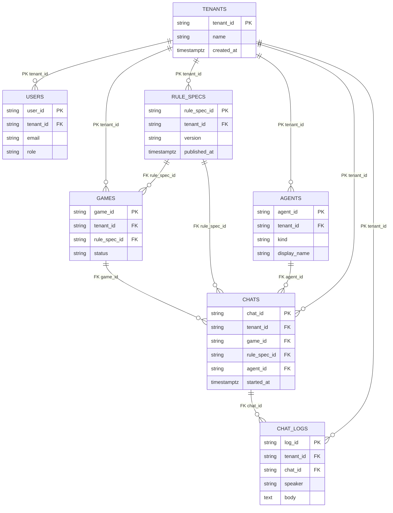

# MeepleAI Monorepo

Questo repository ospita gli stack principali di MeepleAI:

- **apps/web** – front-end Next.js per l'interfaccia degli agenti Meeple.
- **apps/api** – API .NET per ingesti PDF, Q&A e seed di demo.
- **infra/** – definizioni Docker Compose e file di ambiente per avviare rapidamente i servizi di base (Postgres, Redis, Qdrant, n8n, API e web).

## Avvio rapido con Docker Compose

1. Personalizza i file di esempio in `infra/env` (puoi modificarli direttamente oppure copiarli in file `.env` non tracciati se preferisci mantenere override locali). Tutti i valori forniti di default sono sicuri per lo sviluppo locale.
2. Avvia lo stack completo:
   ```bash
   cd infra
   docker compose up -d --build
   ```
3. Apri il front-end su [http://localhost:3000](http://localhost:3000) e le API su [http://localhost:8080](http://localhost:8080).

Ogni servizio espone un healthcheck nel `docker-compose.yml`, per cui `docker compose ps` mostra lo stato "healthy" quando l'avvio è completo.

## Database

### Avvio di Postgres via Docker Compose

- Il servizio Postgres è definito in `infra/docker-compose.yml` con credenziali di default `meeple / meeplepass` e database `meepleai`.\
  Puoi avviare solo il database (più eventuali dipendenze) con:
  ```bash
  cd infra
  docker compose up -d postgres
  ```
- Il volume `pgdata` mantiene i dati tra i riavvii; lo script `infra/init/postgres-init.sql` è montato come bootstrap e rimane vuoto perché lo schema è gestito da EF Core.

### Migrazioni EF Core

- Assicurati di avere installato lo strumento CLI (`dotnet tool install --global dotnet-ef`) e di esportare le variabili d'ambiente presenti in `infra/env/api.env.example` o in un tuo `.env` locale.
- Posizionati nel progetto API e applica le migrazioni con:
  ```bash
  cd apps/api/src/Api
  dotnet ef database update
  ```
  Se stai aggiungendo una nuova migrazione, usa `dotnet ef migrations add <NomeMigrazione>` specificando `--project` e `--startup-project` se lavori da una directory diversa.
- Le migrazioni generate sono versionate nella cartella `apps/api/src/Api/Migrations/`, così da avere commit tracciabili insieme al codice applicativo.

### Modello ER multi-tenant



> Multi-tenant indexing: oltre alle chiavi primarie, ogni tabella deve avere almeno un indice composto su `(tenant_id, <chiave_naturale>)` e indici aggiuntivi su `(tenant_id, game_id)` per `chats` e `(tenant_id, published_at)` per `rule_specs` per supportare filtri e retention richiesti da DB-01.

### Seed demo e vincoli di tenancy

- L'endpoint `POST /admin/seed` popola (o rigenera) una demo di regole di gioco tramite `RuleSpecService`, utile per validare rapidamente lo stack QA; lo script `scripts/seed-demo.ps1` lo invoca automaticamente contro le API locali.
- Il front-end si connette usando `NEXT_PUBLIC_TENANT_ID=dev`, quindi i dati demo devono sempre essere creati con `tenant_id = "dev"` e `game_id = "demo-chess"` per permettere alle chiamate `/agents/qa` di funzionare senza configurazione aggiuntiva.
- Le chat devono referenziare sia il gioco (`game_id`) sia il modello di regole (`rule_spec_id`) per il tenant corrente; la cancellazione di un tenant deve propagare tramite cascade verso utenti, giochi, agenti, chat e log per evitare orfani e mantenere l'isolamento. Quando si applicano nuove migrazioni verificare che tutte le FK abbiano `ON DELETE CASCADE` o strategie equivalenti compatibili con RLS.
- Per la verifica di DB-01 assicurarsi che: (1) tutte le tabelle includano `tenant_id NOT NULL`, (2) gli indici multi-tenant siano presenti, e (3) i dati seed rispettino l'isolamento (nessun record cross-tenant, chat/log sempre filtrati per `tenant_id` e `game_id`).

## Struttura

```
apps/
  web/          # Next.js app + Dockerfile + .env.example
  api/          # Progetto .NET (Api + test + Dockerfile)
infra/
  docker-compose.yml
  env/          # File .env.* di esempio per i servizi
  init/         # Script inizializzazione Postgres
meepleai_backlog/ # Backlog prodotto
scripts/, tools/, schemas/ ...
```

## Test locali

- Front-end: `cd apps/web && npm test`
- API: `cd apps/api && dotnet test` (richiede .NET 8 SDK installato in locale)

Per altre linee guida consulta `agents.md` e i README specifici nelle rispettive app.
