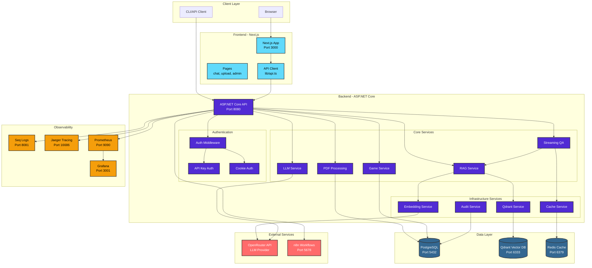
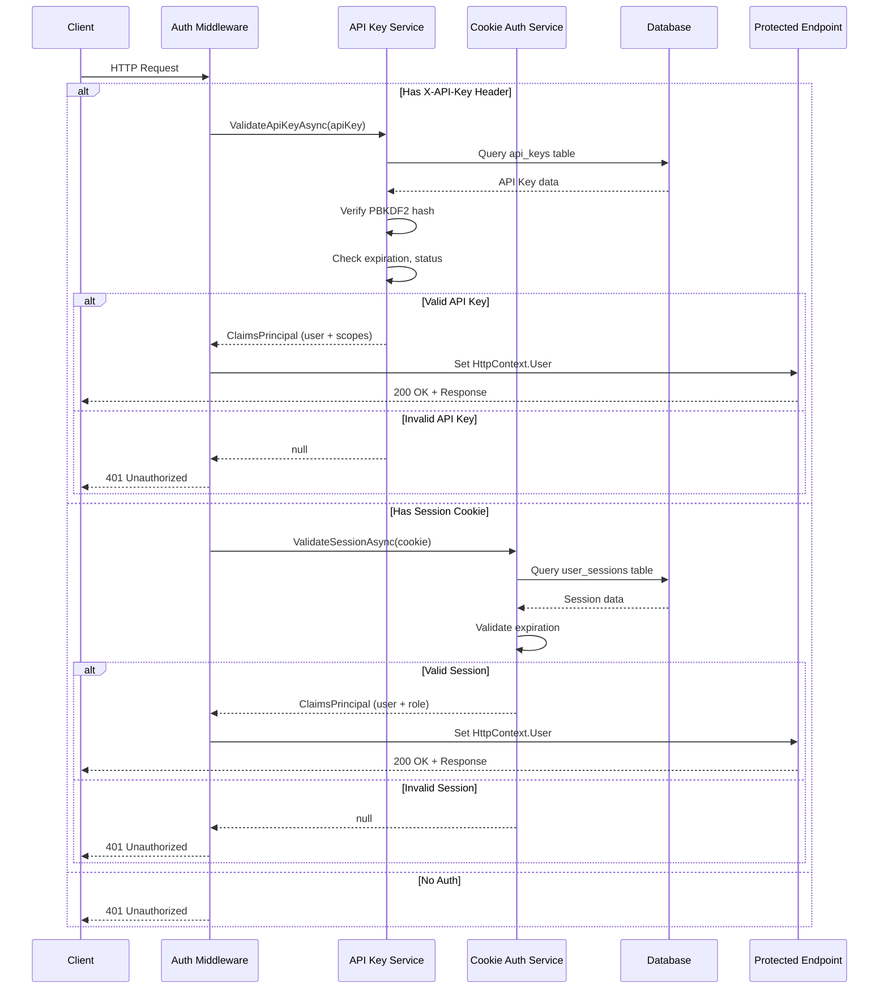
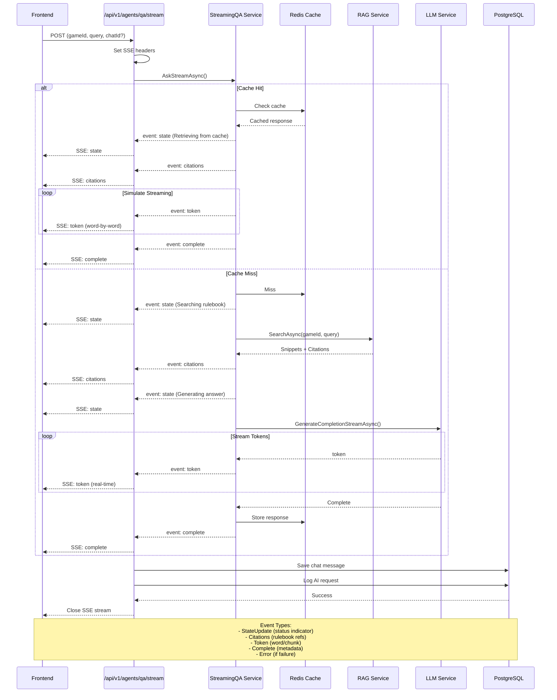
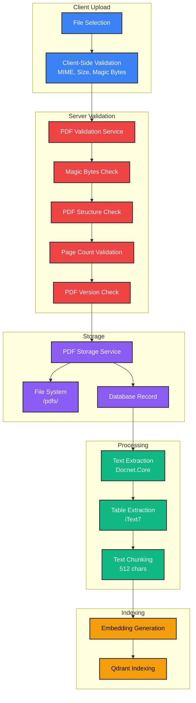
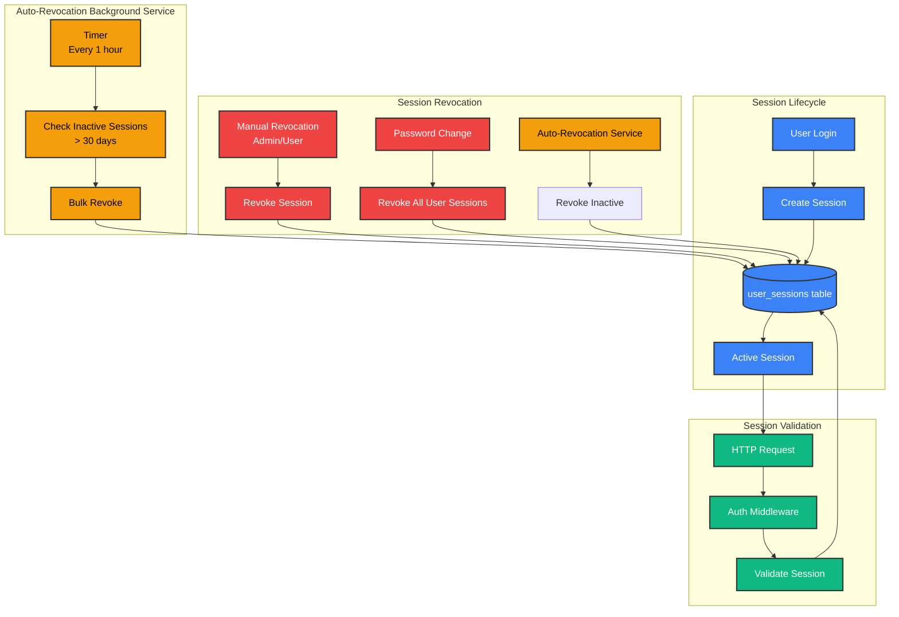
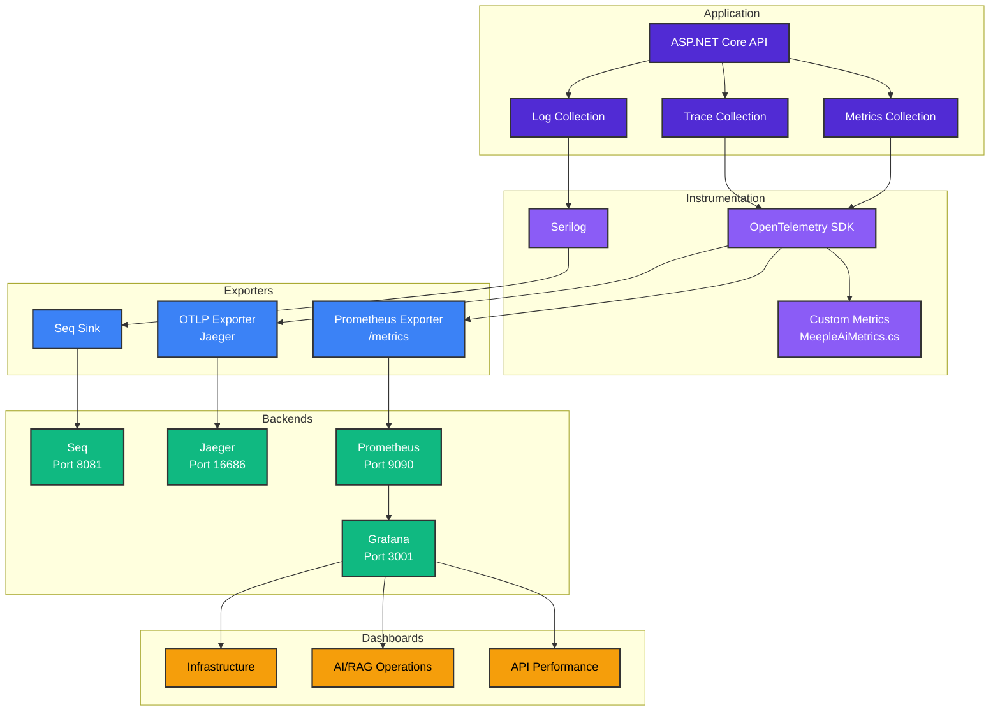

# MeepleAI Architecture Diagrams

Diagrammi di architettura del sistema MeepleAI con Mermaid.

## Architettura di Sistema

## Dual Authentication Flow

## RAG/Vector Pipeline

```mermaid
graph LR
    subgraph "PDF Upload"
        Upload[PDF Upload]
        Validation[PDF Validation]
        Storage[PDF Storage]
    end

    subgraph "Text Processing"
        Extraction[Text Extraction<br/>Docnet.Core]
        Chunking[Text Chunking<br/>512 chars, 50 overlap]
    end

    subgraph "Embedding"
        EmbedAPI[Embedding Service]
        OpenRouter[OpenRouter API<br/>text-embedding-3-small]
    end

    subgraph "Vector Storage"
        Qdrant[Qdrant Vector DB]
        Collection[Game Collection]
    end

    subgraph "RAG Query"
        Query[User Query]
        RagSearch[RAG Search]
        Retrieval[Top-K Retrieval]
        LLM[LLM Generation]
        Response[AI Response]
    end

    Upload --> Validation
    Validation --> Storage
    Storage --> Extraction
    Extraction --> Chunking
    Chunking --> EmbedAPI
    EmbedAPI --> OpenRouter
    OpenRouter --> Qdrant
    Qdrant --> Collection

    Query --> RagSearch
    RagSearch --> Retrieval
    Retrieval --> Collection
    Collection --> LLM
    LLM --> Response

    classDef upload fill:#3b82f6,stroke:#333,stroke-width:2px,color:#fff
    classDef process fill:#8b5cf6,stroke:#333,stroke-width:2px,color:#fff
    classDef vector fill:#10b981,stroke:#333,stroke-width:2px,color:#fff
    classDef query fill:#f59e0b,stroke:#333,stroke-width:2px,color:#000

    class Upload,Validation,Storage upload
    class Extraction,Chunking,EmbedAPI,OpenRouter process
    class Qdrant,Collection vector
    class Query,RagSearch,Retrieval,LLM,Response query
```

## Streaming SSE Flow (CHAT-01)

## PDF Processing Pipeline

## Session Management (AUTH-03)

## Observability Stack (OPS-01, OPS-02)

## Legend

- **Blue**: Client/Frontend components
- **Purple**: Backend/API services
- **Green**: Data stores/Vector DB
- **Red**: External services
- **Orange/Yellow**: Observability/Monitoring

## References

- System Architecture: `docs/README.md`
- Authentication: `docs/SECURITY.md`
- RAG Pipeline: `docs/ai-06-rag-evaluation.md`
- Streaming: `docs/issue/chat-01-streaming-sse-implementation.md`
- PDF Processing: `docs/technic/pdf-processing-design.md`
- Session Management: AUTH-03 implementation
- Observability: `docs/observability.md`, `docs/technic/ops-02-opentelemetry-design.md`
